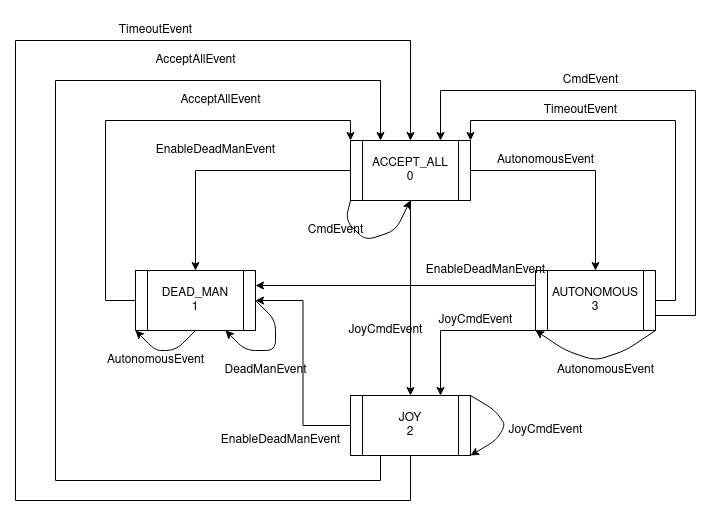

# Panther driver

Software for controlling Panther robot motors via CAN interface.

## ROS API

### Publish
 - Node: `driver (?)`
   - `/battery` *(sensor_msgs/BatteryState)*
   - `/joint_states` *(sensor_msgs/JointState)*
   - `/pose` *(geometry_msgs/Pose)*
   - `/tf` *(tf2_msgs/TFMessage)*
   - `/odom/wheel` *(nav_msgs/Odometry)* - default not active
 - Node: `velocity_manager`
   - `cmd_vel_filtered` *(geometry_msgs/Twist)* - filtered `cmd_vel` by topic.
   - `panther_driver/manager/status` *(husarion_msgs/PantherDriverStatus)* - status of state machine.

For a `/joint_states` message is crying given data:

- `position = [Front left, Front right, Rear left, Rear right]` - Encoder pulses

- `velocity = [Front left, Front right, Rear left, Rear right]` - Encoder pulses per second

- `effort = [Front left, Front right, Rear left, Rear right]` - Motor current in Amps


### Subscribe
 - Node: `driver (?)`
    - `/cmd_vel` *(geometry_msgs/Twist)*

### Parameters
 - Node: `driver (?)`

    - `~can_interface` *(string, default: "panther_can")* - CAN interface used for controlling motors. Possible to find using *"ip addr"* command or *"ifconfig"*.

    - `~wheel_type` *(string, default: "classic")* - specifies kinematics model used for calculating inverse and forward kinematics. More info below.

    - `~odom_frame` *(string, default: odom)* -specifies frame under which "/tf" or "/odometry" topic is published.

    - `~base_link_frame` *(string, default: base_link)* - specifies base link frame name.

    - `~publish_tf` *(bool, default: true)* - specifies whether to publish transform from odom_frame to base_link_frame. Provides X,Y and rotation. Z translation is always 0.

    - `~publish_pose` *(bool, default: true)* - specifies whether publish pose under topic "/pose".

    - `~publish_odometry` *(bool, default: false)* - specifies whether publish pose under topic "odom/wheel". Should be used with Kalman filter. 

    - `~robot_width` *(double, default: 0.682)* - distance from center of wheel to center of opposite wheel. Unit **[m]**.

    - `~robot_length` *(double, default: 0.44)* - distance between axles. Unit **[m]**.

    - `~wheel_radius` *(double, default: 0.1825)* - radius of a wheel. Unit **[m]**.

    - `~eds_file` *(string, default: "$(find panther_driver)/params/roboteq_motor_controllers_v60.eds")* - path to Electronic Data Sheet file.
    

### Kinematics type

Panther can be configured with different wheels to match your needs, we provide 3 different kinematics types `classic`/`mecanum`/`mix` you can change type by selecting appropriate parameter in launch file - `wheel_type`. Mix type means mecanum wheels at the front and classic at the back.

Default launch file is `launch/driver.launch` [repository](https://github.com/husarion/panther_driver/blob/main/launch/driver.launch) 


Example launch file: 

```xml
<launch>
    <arg name="kinematics_type" default="classic"/>  <!-- "classic" / "mecanum" / "mix" -->
  
    <node pkg="panther_driver" name="panther_driver" type="driver_node.py" output="screen" required="true">
        <param name="can_interface" type="string" value="panther_can"/>
        <param name="wheel_type" type="string" value="$(arg kinematics_type)"/>
        
        <param name="odom_frame" type="string" value="odom"/>
        <param name="base_link_frame" type="string" value="base_link"/>
        <param name="publish_tf" type="string" value="false"/>
        <param name="publish_pose" type="string" value="false"/>
        <param name="publish_odometry" type="string" value="true"/>

        <param name="robot_width" type="double" value="0.682"/>
        <!-- distance between center of wheels -->
        <param name="robot_length" type="double" value="0.44"/>
        <!-- distance between axes-->
        <param name="wheel_radius" type="double" value="0.1825"/>
        <!-- for mecanum 0.1015-->

        <param name="eds_file" type="string" value="$(find panther_driver)/params/roboteq_motor_controllers_v60.eds"/>
    </node>

</launch>
```

For kalman filter setup please refer to [panther_ekf](https://github.com/adamkrawczyk/panther_ekf)


# Fix set_driver_startup.py

## Usage
With both service added, driver and webui start with system boot.
Open PANTHER_IP:8000 and you will be able to drive robot with use of joystick.


## Velocity Manager

It's node dealing with many sources of /cmd_vel. Subscribes to /cmd_vel and publishes at /cmd_vel_filtered. 

State machine got 4 states `AcceptAllState, DeadManState, JoyState, AutonomousState` in this order. 

To drive robot from joy hold `LB` (enable button) and left directional pad (D-pad). This will cause to going into JoyState.

Timeout is set to 5s and moves from JoyState an AutonomusState to AcceptAllState.

Going into DeadManState (To drive autonomously have to hold `LB + A`) is realized by pressing `X`. 

`Y` is a button which enables to get back to AcceptAllState (default state).

Schematic of state:


### Drive speed

Control speed by pressing `RB` -> parking mode, and `RT` -> fast drive mode.

## CAN bus

Documentation for USB-CAN converter:
https://ucandevices.github.io/uccb.html#!#socketCAN

### CAN bitrate
Slcan tool take `-sX` argument to set CAN bitrate. Below table contains valid values.

| ASCII Command | CAN Bitrate |
| ---           | ---         |
| s0            | 10 Kbit/s   |
| s1            | 20 Kbit/s   |
| s2            | 50 Kbit/s   |
| s3            | 100 Kbit/s  |
| s4            | 125 Kbit/s  |
| s5            | 250 Kbit/s  |
| s6            | 500 Kbit/s  |
| s7            | 800 Kbit/s  |
| s8            | 1000 Kbit/s |

## Docker examples
### Panther hardware setup
``` bash
cd examples/panther_robot
docker-compose up --build
```

### Test software
``` bash
docker build -t panther-driver:test . --build-arg run_tests=true
```