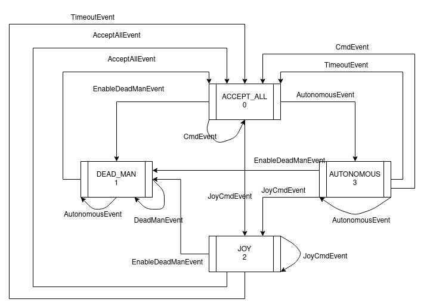

# Panther driver

Software for controlling Panther robot motors via CAN interface.

## Installation

### Install Python canopen library:
It is a Python library for CAN inetrfaace

```
sudo pip install canopen
```

### Install 'can-utils' - driver for USB-CAN converter
```
sudo apt install can-utils
```

### Install Husarion repositories
We are using web ui with simple joystick to send velocity commands and custom driver to translate ROS messages to CAN frames.
```
cd ~/husarion_ws/src
git clone https://github.com/husarion/webui-ros-joystick.git
git clone https://github.com/hsrn24/panther_driver.git
cd ~/husarion_ws
catkin_make
cd ~/husarion_ws/src/webui-ros-joystick/nodejs
npm install rosnodejs express socket.io yargs
```

## Set system services
This step is not mandatory, but will make easier robot up startup process.

Use `update_startup.sh` to set required services:

```
cd scripts
sudo ./update_startup.sh
```

### CAN bitrate
Slcan tool take `-sX` argument to set CAN bitrate. Below table contains valid values.

| ASCII Command | CAN Bitrate |
| ---           | ---         |
| s0            | 10 Kbit/s   |
| s1            | 20 Kbit/s   |
| s2            | 50 Kbit/s   |
| s3            | 100 Kbit/s  |
| s4            | 125 Kbit/s  |
| s5            | 250 Kbit/s  |
| s6            | 500 Kbit/s  |
| s7            | 800 Kbit/s  |
| s8            | 1000 Kbit/s |

## ROS API

### Published Topics

 * /battery [sensor_msgs/BatteryState]

 * /joint_states [sensor_msgs/JointState]
 
 * /pose [geometry_msgs/Pose]
 
 * /tf [tf2_msgs/TFMessage]
 
 * /odom/wheel [nav_msgs/Odometry] - default not active


### Subscribed Topics

* /cmd_vel [geometry_msgs/Twist]

### Parameters

`~can_interface` (string, default: panther_can) 

    Specifies can interface used for controlling motors. Can be checked using "ip addr" command or "ifconfig".

`~wheel_type` (string, default: classic)

    Specifies kinematics model used for calculating inverse and forward kinematics. Classic is 4 identical rubber or other wheels able to rotate around only one axis. Mecanum is for 4 identical mecanum wheels. Mix type means mecanum wheels at the front and classic at the back.

`~odom_frame` (string, default: odom)

    Specifies frame under which "/tf" or "/odometry" topic is published.

`~base_link_frame` (string, default: base_link)

    Specifies base link frame name.

`~publish_tf` (bool, default: true)

    Specifies whether to publish transform from odom_frame to base_link_frame. Provides X,Y and rotation. Z translation is always 0.

`~publish_pose` (bool, default: true)

    Specifies whether publish pose under topic "/pose".

`~publish_odometry` (bool, default: false)

    Specifies whether publish pose under topic "odom/wheel". Should be used with Kalman filter. 

`~robot_width` (double, default: 0.682)

    Value of axle width default value should change only if you replace roller or wheels that have different width. Provide distance from center of wheel to center of opposite wheel. Provided unit is meter [m].

`~robot_length` (double, default: 0.44)

    Distance between axles - should not be changed. Provided unit is meter [m].

`~wheel_radius` (double, default: 0.1825)

    Radius of a wheel. Provided unit is meter [m].

`~eds_file` (string, default: " ")

    Path to Electronic Data Sheet file, by default file is under "params/roboteq_motor_controllers_v60.eds" so default value used as rosparam is: 
    
    <param name="eds_file" type="string" value="$(find panther_driver)/params/roboteq_motor_controllers_v60.eds"/>
    

### Kinematics type

Panther can be configured with different wheels to match your needs, we provide 3 different kinematics types `classic`/`mecanum`/`mix` you can change type by selecting appropriate parameter in launch file - `wheel_type`. Mix type means mecanum wheels at the front and classic at the back.

Default launch file is `launch/driver.launch` [repository](https://github.com/husarion/panther_driver/blob/main/launch/driver.launch) 


Example launch file: 

```xml
<launch>
    <arg name="kinematics_type" default="classic"/>  <!-- "classic" / "mecanum" / "mix" -->
  
    <node pkg="panther_driver" name="panther_driver" type="driver_node.py" output="screen" required="true">
        <param name="can_interface" type="string" value="panther_can"/>
        <param name="wheel_type" type="string" value="$(arg kinematics_type)"/>
        
        <param name="odom_frame" type="string" value="odom"/>
        <param name="base_link_frame" type="string" value="base_link"/>
        <param name="publish_tf" type="string" value="false"/>
        <param name="publish_pose" type="string" value="false"/>
        <param name="publish_odometry" type="string" value="true"/>

        <param name="robot_width" type="double" value="0.682"/>
        <!-- distance between center of wheels -->
        <param name="robot_length" type="double" value="0.44"/>
        <!-- distance between axes-->
        <param name="wheel_radius" type="double" value="0.1825"/>
        <!-- for mecanum 0.1015-->

        <param name="eds_file" type="string" value="$(find panther_driver)/params/roboteq_motor_controllers_v60.eds"/>
    </node>

</launch>
```

For kalman filter setup please refer to [panther_ekf](https://github.com/adamkrawczyk/panther_ekf)

## Setup autostart

# Fix set_driver_startup.py

## Usage
With both service added, driver and webui start with system boot.
Open PANTHER_IP:8000 and you will be able to drive robot with use of joystick.


## Viewing measurement data

User can preview some of the sensor data using command line
Connect with robot through SSH:

```
ssh husarion@PANTHER_IP
```

### Battery voltage
```
rostopic echo /battery
```

### Encoders, motor speed, motor current

```
rostopic echo /joint_states
```
You will see data structured as ROS message `sensor_msgs/JointState` with fields:

`position = [Front left, Front right, Rear left, Rear right]` - Encoder pulses

`velocity = [Front left, Front right, Rear left, Rear right]` - Encoder pulses per second

`effort = [Front left, Front right, Rear left, Rear right]` - Motor current in Amps

## Velocity Manager

It's node dealing with many sources of /cmd_vel. Subscribes to /cmd_vel and publishes at /cmd_vel_filtered. 

State machine got 4 states `AcceptAllState, DeadManState, JoyState, AutonomousState` in this order. 

To drive robot from joy hold `LB` (enable button) and left directional pad (D-pad). This will cause to going into JoyState.

Timeout is set to 5s and moves from JoyState an AutonomusState to AcceptAllState.

Going into DeadManState (To drive autonomously have to hold `LB + A`) is realized by pressing `X`. 

`Y` is a button which enables to get back to AcceptAllState (default state).

Schematic of state:


### Drive speed

Control speed by pressing `RB` -> parking mode, and `RT` -> fast drive mode.
# Used docs
Documentation for USB-CAN converter:
https://ucandevices.github.io/uccb.html#!#socketCAN
