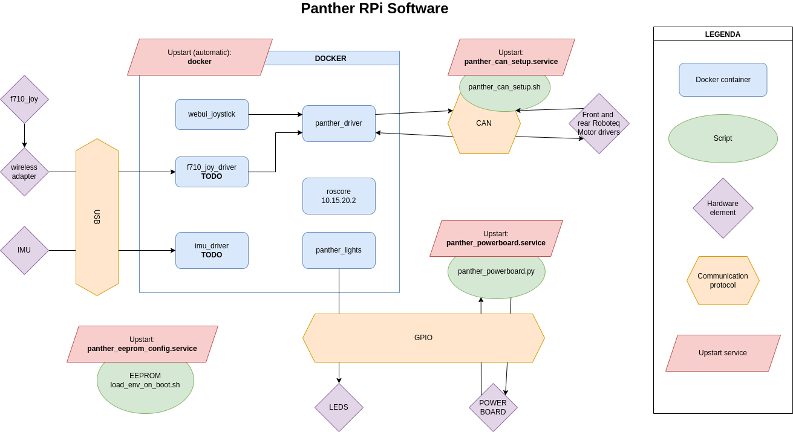

# Panther RPi Software Description

Full diagram of software structure no RPi Computer on  Panther robot

## Diagram

## Docker containers

### 1. panther_driver
Contains implementation of robot kinematics and CAN communication with drivers.
 - [Github](https://github.com/husarion/panther_driver/tree/main) ***TODO - FIX Merge branch docker-dev***
 - Dockerhub ***TODO - not yet on dockerhub***
### 2. webui-ros-joystick
Contains implementation of web joystick using nodejs. Joystick is used to control the robot.
 - [Github](https://github.com/husarion/webui-ros-joystick/tree/master) ***TODO - FIX Merge branch docker-dev***
 - [Dockerhub](https://hub.docker.com/r/husarion/webui-ros-joystick)

### 3. logitech_f710_ros
***TODO - Not deployed, not tested*** 
Driver for logitech f710 pad for robot control.
 - [Github](https://github.com/husarion/logitech_f710_ros)
 - [Dockerhub](https://hub.docker.com/r/husarion/webui-ros-joystick)

### 4. imu_driver 
***TODO - Not implemented*** 
Should be a docker wraper for ros drivers of Phigets Spatial Imu.

### 5. roscore
Common roscore for all ros1 nodes on Panther sbc as well as main computer. Ip address is should be the same as hots, 10.15.20.2 
 - [Dockerhub](https://hub.docker.com/_/ros)

### 6. panther_lights
Implemetation of led usage for panther robot.
 - [Github](https://github.com/husarion/panther_lights)
 - Dockerhub ***TODO - not yet on dockerhub***

## Services

All services are upstarted by `systemd` be found in /etc/system/systemd with their `.service` names

***TODO*** Source scripts for now CAN be found in `panther_system_setup` directory od this repo

List:
 - CAN - setup of CAN communication
 - Powerboard - communication with Powerboard using gpio on RPi
 - Eeprom - parsing of config in eeprom

## Hardware

***TODO: Device: model?***

